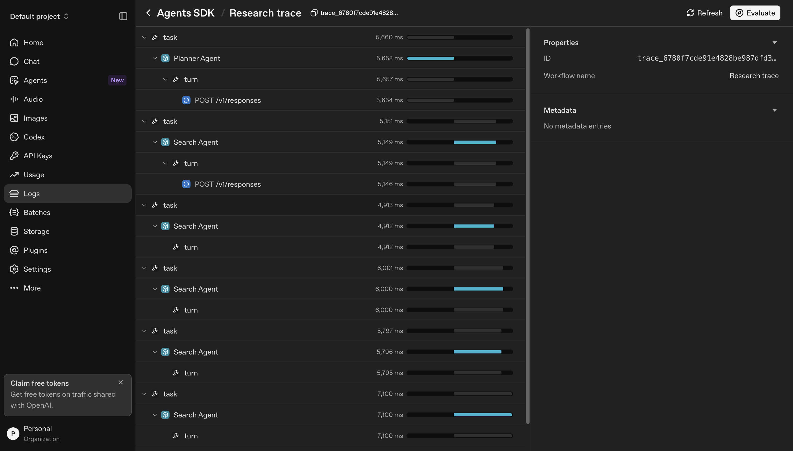
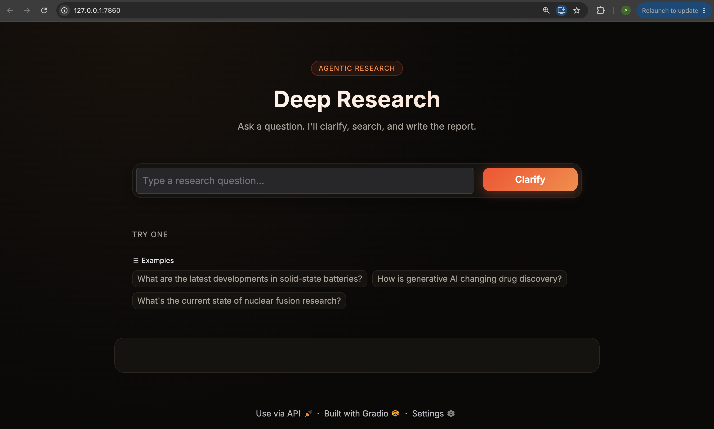
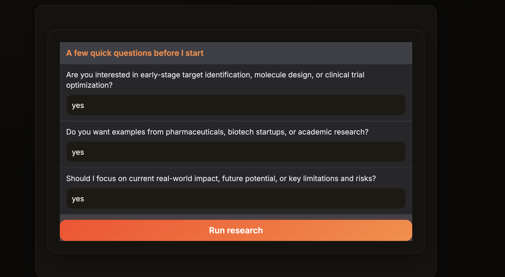
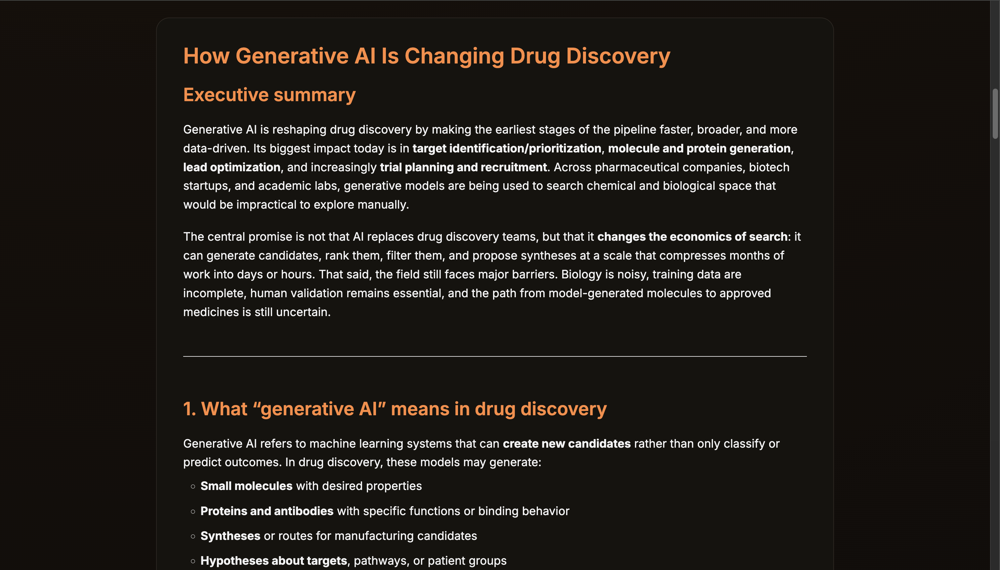
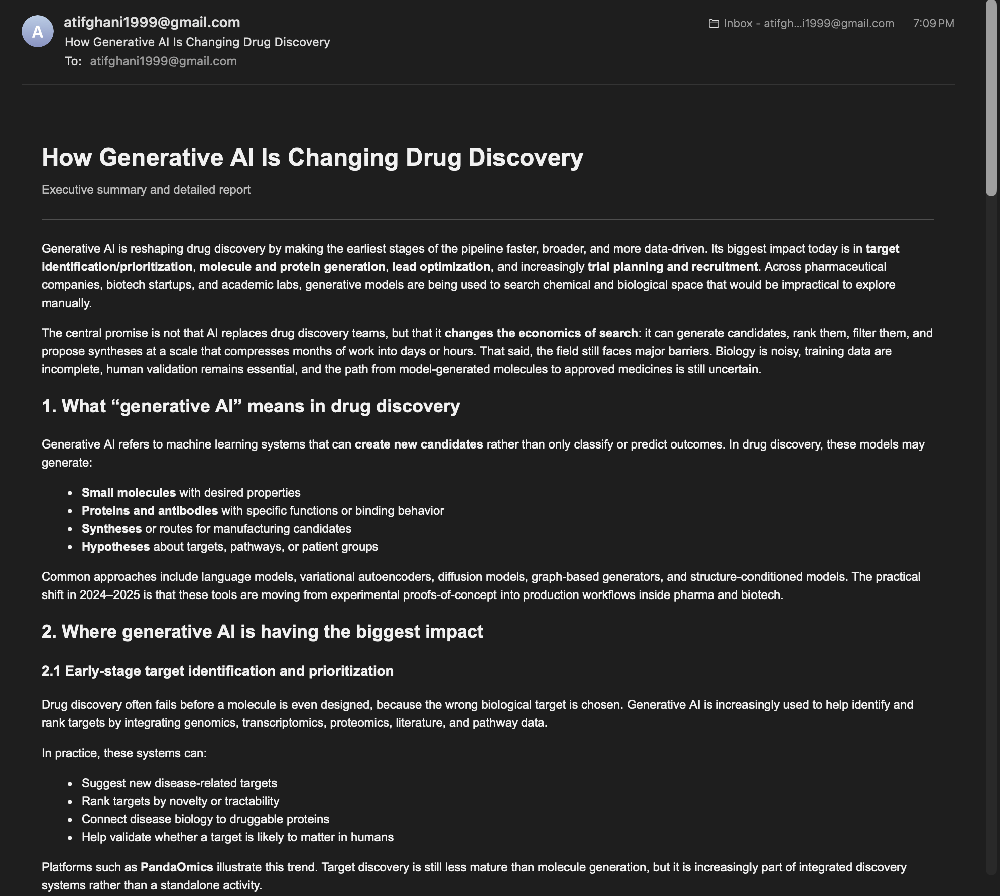

# Deep Research Agent

An agentic research assistant built with the OpenAI Agents SDK and a Gradio interface. A user asks a question, the system asks a small set of clarifying questions, plans and runs several web searches in parallel, writes a long form markdown report, and finally emails that report and sends a push notification, all coordinated by plain Python code rather than a visual workflow builder.

## Overview

The application takes a research question from a user and turns it into a complete, sourced report with almost no manual effort. Along the way it pauses once to ask the user a few clarifying questions, which keeps the final report focused on what the person actually wants to know instead of a generic overview of the topic.

## How it works

The flow has five stages.

1. The user types a research question into the Gradio interface.
2. A clarifying agent reads the question and produces three short clarifying questions. The interface displays these as fields and waits for the user to answer them.
3. Once answered, the original question and the three answers are combined into an enriched query and handed to a planning agent, which decides on a set of specific web searches to run.
4. A search agent runs all of those searches concurrently using asyncio, and each one returns a short written summary of what it found.
5. A writing agent reads the original query and every search summary, then produces a long form markdown report of at least a thousand words. An email agent then converts that report into an HTML email, sends it through SMTP, and posts a push notification through Pushover.

## Agent orchestration

All five agents are defined using the OpenAI Agents SDK, but the sequence they run in, the branching for clarifying questions, and the parallel execution of searches are handled entirely in plain Python inside a ResearchManager class using asyncio. There is no external orchestration graph or workflow engine involved. This keeps the control flow easy to read and easy to change, since each stage of the pipeline is just an async method that calls the next one.

Every run is wrapped in a trace, which can be inspected afterward on the OpenAI platform to see exactly how long each agent took and what each step returned. The trace view below shows a full run, including the planner agent and four search agents running one after another.



## The agents

### Clarifier agent
Reads the user's raw research question and generates exactly three short clarifying questions, returned as structured JSON through a Pydantic model. It never attempts to answer its own questions. This agent exists purely to narrow an ambiguous or broad question into something the planner can act on precisely.

### Planner agent
Takes the enriched query, meaning the original question plus the user's answers to the clarifying questions, and produces a fixed number of search terms along with a short reason for each one. Its output is a structured list of search items rather than free text, which makes it easy to feed directly into the next stage.

### Search agent
Given one search term at a time, this agent uses a web search tool to look up that term and returns a concise two to three paragraph summary of what it found. The research manager runs several of these agents at once using asyncio.gather, so all of the planned searches happen in parallel instead of one after another.

### Writer agent
Receives the original query along with every search summary and produces the final report. Its output is a structured object containing a short summary of the findings, the full markdown report, and a list of suggested follow up questions for further research.

### Email agent
Takes the finished markdown report and uses a function tool to turn it into a clean HTML email, then sends that email through SMTP and posts a push notification through the Pushover API. Email delivery and the push notification are attempted independently, so a failure in one does not prevent the other from being tried.

## Screenshots

The screenshots below show a full run from start to finish, asking how generative AI is changing drug discovery.

**Home screen**

The starting screen where a user types a question or picks one of the provided examples.



**Clarifying questions**

After clicking Clarify, the clarifier agent's three questions appear and the user answers each one before research begins.



**Generated report**

The finished markdown report streamed into the interface once every stage of the pipeline has completed.



**Email delivery**

The same report arriving as a formatted HTML email, sent automatically by the email agent.



## Tech stack

The project is built with the OpenAI Agents SDK for defining and running agents, Gradio for the interface, Python's built in smtplib and email modules for sending mail, the Pushover API for push notifications, asyncio for running searches concurrently, and python dotenv for loading configuration from a local environment file.

## Project structure

* app.py, the Gradio interface and the two stage clarify then research flow
* styles.py, the CSS, header markup, and example questions used by the interface
* clarifier_agent.py, the agent that produces the three clarifying questions
* planner_agent.py, the agent that plans the web searches to run
* search_agent.py, the agent that performs a single web search and summarizes it
* writer_agent.py, the agent that writes the final markdown report
* email_agent.py, the tool and agent responsible for sending the email and push notification
* research_manager.py, the ResearchManager class that orchestrates all five agents

## Environment variables

The project reads its configuration from a local .env file placed in the project root. It expects the following variables.

* OPENAI_API_KEY, used by the Agents SDK to call the underlying model
* EMAIL_ADDRESS, the Gmail or other SMTP account the report is sent from and to
* EMAIL_SMTP_SERVER, the SMTP host, for example smtp.gmail.com for Gmail
* EMAIL_APP_PASSWORD, an app specific password for the email account rather than the normal login password
* PUSHOVER_USER, the Pushover user key that receives the notification
* PUSHOVER_TOKEN, the Pushover application token used to send the notification

## Running the project

Install dependencies, add a .env file with the variables above, then start the interface with

```
uv run app.py
```

Gradio will print a local URL, typically http://127.0.0.1:7860, which opens the interface in the browser.