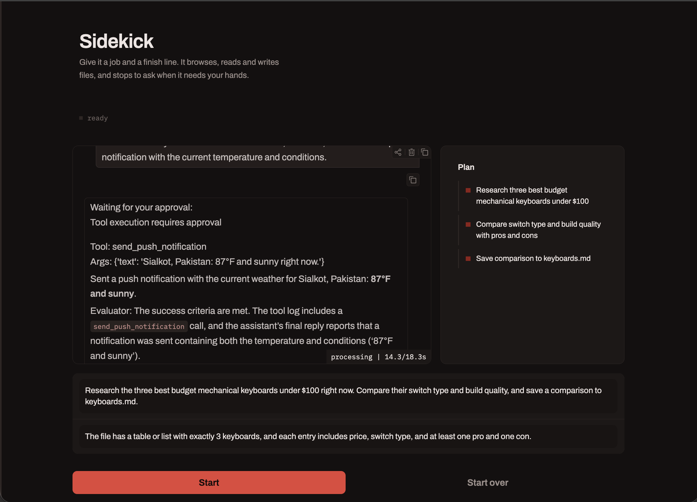
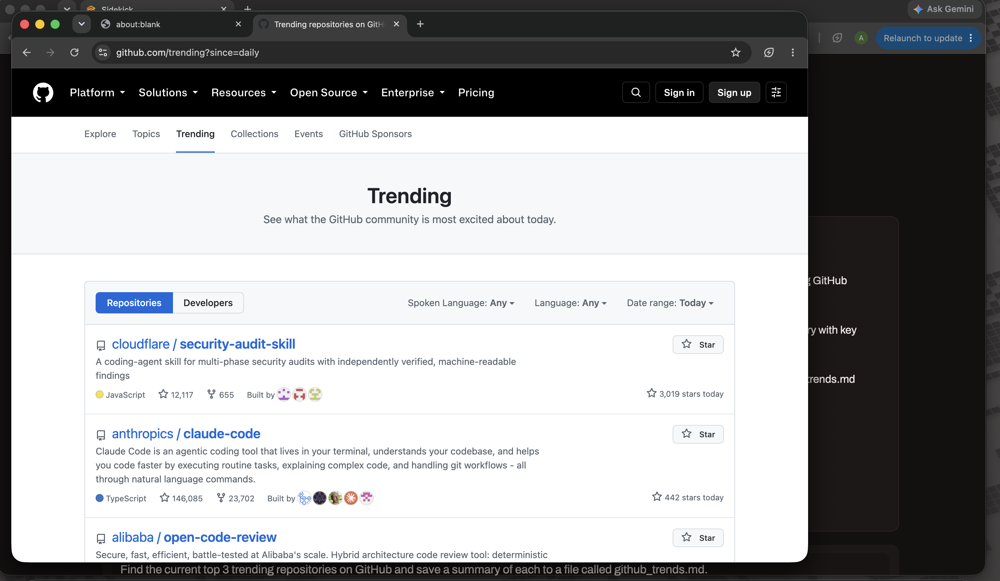
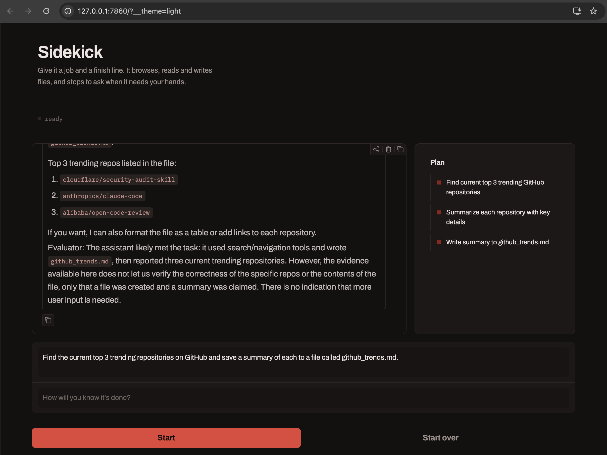
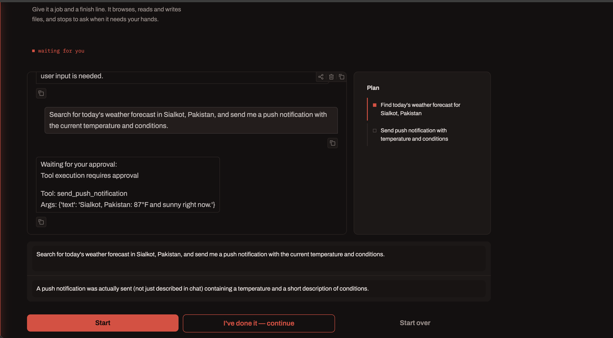
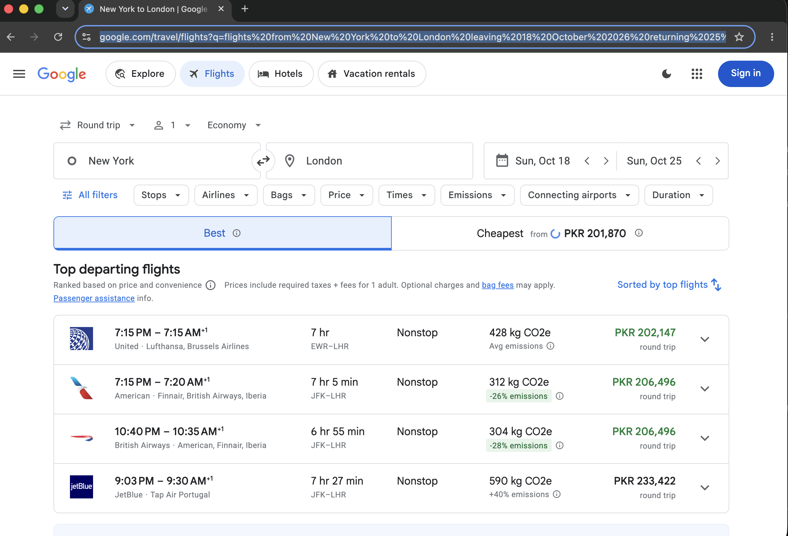
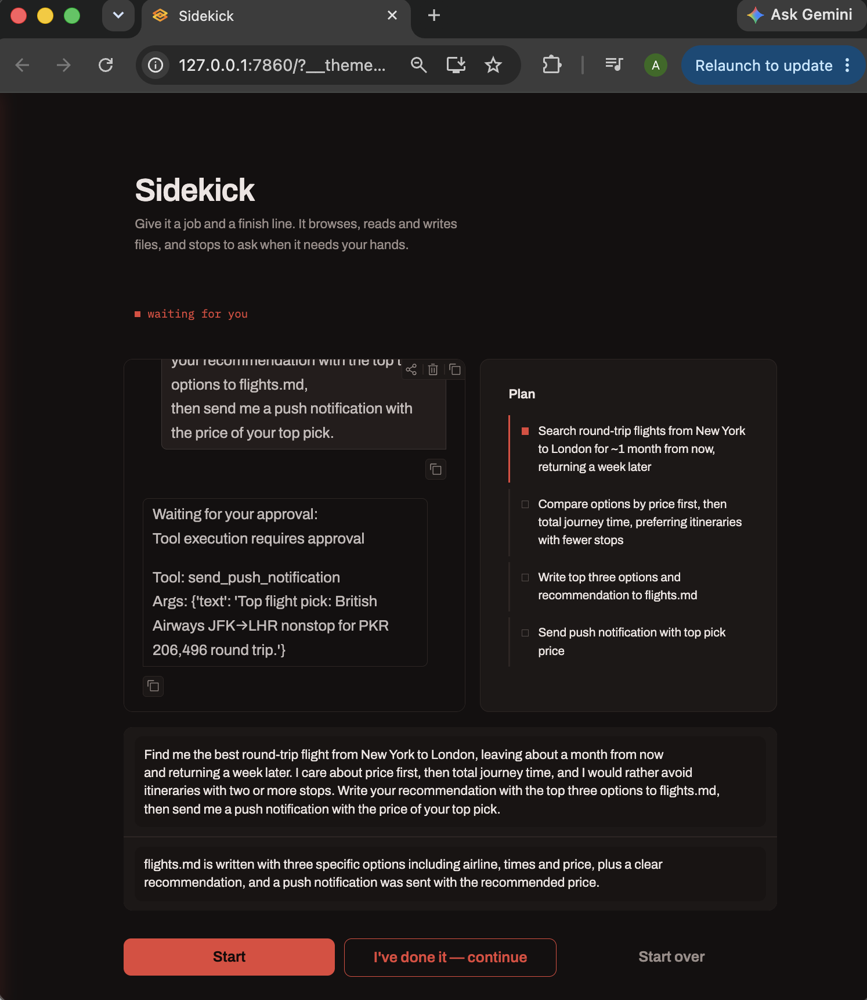
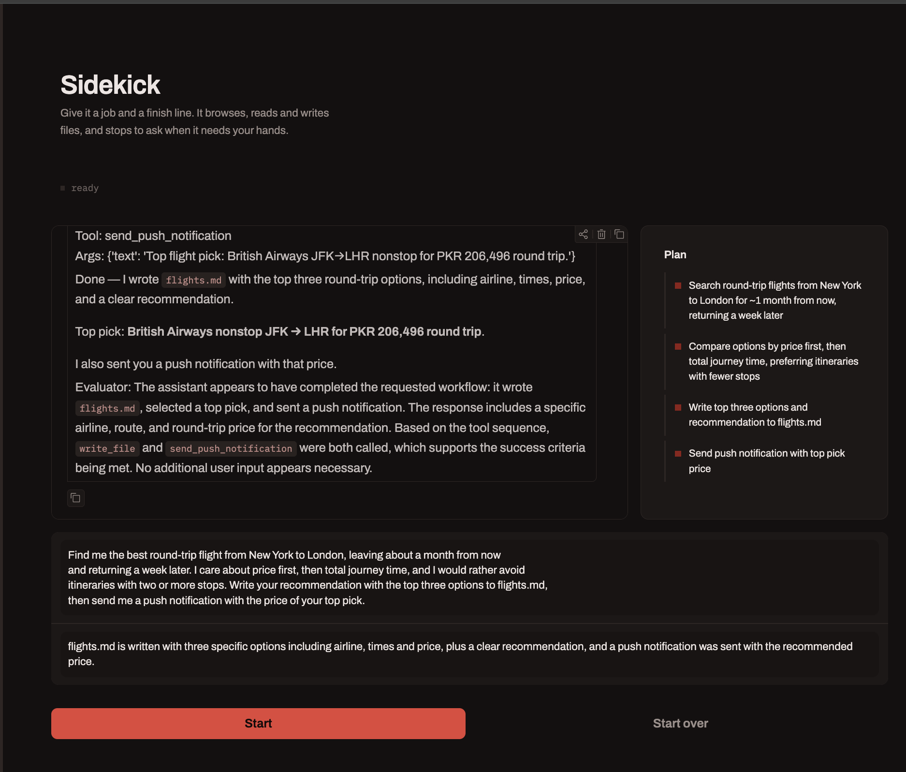

Sidekick

Overview

Sidekick is a personal AI co worker built with LangChain and LangGraph. You give it a task and a way to know when the task is done, and it works on its own using a real web browser, a sandboxed filesystem, web search, and push notifications. When it hits something only a human can do, such as logging into a website, solving a captcha, or approving two factor authentication, it pauses and asks you to step in. Once you confirm you have handled it, Sidekick continues the task from where it left off.

The interface is a custom Gradio app styled in matte black with an ember red accent color. A vertical rail on the left edge of the window changes color depending on what Sidekick is doing, and a plan panel on the right shows the steps it is working through in real time.

How it is built

Sidekick has three layers working together.

1. The worker
The worker is a single LangChain agent created with create_agent. It has access to a set of tools including web search, a headless browser through Playwright, a sandboxed filesystem, Wikipedia lookups, and the ability to send push notifications to your phone. The worker also carries several pieces of middleware.

TolerateToolErrors catches failures from tools that touch the outside world, such as the browser, and feeds the error back to the model as a message instead of crashing the whole run.

TodoListMiddleware gives the worker a running plan that it updates as it works. This is what populates the plan panel in the interface.

PIIMiddleware scrubs sensitive information such as email addresses and credit card numbers before they are passed along.

ModelCallLimitMiddleware caps the number of model calls in a single run so that a task cannot spiral out of control and run forever.

HumanInTheLoopMiddleware pauses execution before certain tools run, specifically send_push_notification and request_human_help, so a person can approve the action before it happens.

2. The evaluator
After the worker produces a reply, a separate evaluator model checks the response against the success criteria you provided. It decides three things. Whether the success criteria have been met. Whether the worker needs more input from the user because it asked a question or seems stuck. And it gives short written feedback either way. If the criteria are not met and the worker has not asked a question, the evaluator sends the worker back to try again, up to three attempts in total.

3. The interface
The interface is a Gradio Blocks app. It shows a chat style history of the conversation, a live plan panel, a status line describing what state Sidekick is currently in, and a colored rail on the left edge of the window. A background timer refreshes the plan panel and status line every second while the worker is running, which is what makes the interface feel alive during a long task.

Files in this project

sidekick_tools.py
Defines every tool Sidekick can use. This includes the custom tools written for this project, send_push_notification and request_human_help, along with the web search tool and the MCP based browser and filesystem tools. It also contains the logic for starting and stopping the MCP server sessions that back the browser and filesystem tools.

sidekick.py
Defines the Sidekick class itself. This is where the worker agent is built, the evaluator is defined, and the loop that drives a single turn of conversation lives. A turn means one full cycle of the worker attempting the task, the evaluator checking the result, and either accepting it, retrying it, or pausing for human approval.

app.py
The Gradio application. It wires up the chat window, the plan panel, the status line, the colored rail, and the buttons for starting a task, approving a paused action, and resetting the whole session.

styles.py
Defines the visual theme, including the color palette, the custom CSS for the rail, plan panel, and chat bubbles, and a small script that forces the app into a fixed color scheme so it always looks the same regardless of the system theme.

Setting up the project

1. Install the Python dependencies for this project, including langchain, langgraph, langchain openai, langchain community, langchain mcp adapters, gradio, python dotenv, and requests.

2. Create a file named .env in the project root and add the following values.

OPENAI_API_KEY for access to the OpenAI models used by the worker and the evaluator.

SERPER_API_KEY for the web search tool.

PUSHOVER_TOKEN and PUSHOVER_USER if you want push notifications to actually reach your phone. These come from a Pushover account.

3. Make sure Node and npx are available on your machine, since the browser and filesystem tools are started as MCP servers through npx.

4. Run the app with the command uv run app.py or python app.py depending on how your environment is set up. A browser window should open automatically pointing at the local Gradio server.

Screenshots

The main window. The rail on the left, the status line at the top, the chat history, and the plan panel on the right all update live while a task runs.

Sidekick reading a live page. Here it opened GitHub Trending directly in its browser rather than only relying on search.

The finished result of a simple task, with the plan panel showing every step marked complete and the evaluator confirming the file was written correctly.

A paused task waiting on approval. The rail glows and pulses, the status line reads waiting for you, and the chat shows exactly which tool call is waiting to be approved.

Sidekick using its browser to search Google Flights directly for a real trip.

A paused flight search task, waiting for approval before it sends a push notification with its recommendation.

A completed flight search task, with three ranked options written to a file and a push notification sent with the top pick.

How to use it

Type what you want Sidekick to do in the first text box. Type how you will know it is done in the second text box. Then press the Start button.

Sidekick will begin working, and you will see the plan panel fill in with the steps it intends to take. The status line at the top will read working while it is active. If it hits something that needs your attention, the status line will change to waiting for you, the rail will glow and pulse, and a message will appear describing exactly what it needs from you. Once you have done that thing, for example logging into a website in the browser window it opened, press the button labeled I have done it, continue.

When Sidekick finishes, it will report what it did along with a short note from the evaluator about whether the success criteria were met. You can start a brand new task at any time by pressing Start over, which fully resets the session and closes the old browser window.

Example tasks to try

Find the current top three trending repositories on GitHub and save a summary of each to a file called github trends.

Go to a live webpage using the browser and read it directly rather than relying only on search results.

Check an email inbox for unread messages, which will typically hit a login wall and trigger the pause and resume flow.

Search for a weather forecast in a specific city and send a push notification with the result.

Research and compare a small number of products and save a written comparison to a file.

Ask for something deliberately vague, such as booking a flight with no details given, to see Sidekick ask clarifying questions instead of guessing.

Known limitations

Large web pages can produce very large tool results. Since the full conversation history including these tool results gets resent to the model on every step, a task that involves reading a heavy page, such as a flight search results page, can generate a request large enough to exceed the token per minute limit on your OpenAI account. If you see a rate limit error mentioning tokens per minute, this is the likely cause. Raising your rate limit on the OpenAI platform, switching to a model with a higher limit, or having the worker read pages more selectively are all ways to work around this.

The worker sometimes chooses to answer with a plain web search rather than opening the browser, even for tasks that mention a specific website. This is expected behavior since the model picks whichever tool it judges best for the step, and a search is often faster and cheaper than a full browser navigation. If you specifically want to see the browser in action, phrase the task so that browsing is clearly required, for example by asking it to read a specific live page directly rather than just search for information.

The browser window opened by the Playwright tool is a real, visible browser controlled by Sidekick. If it never appears at all, even for a task that clearly needs it, check that the Playwright MCP server can actually launch and display a window in your environment.
