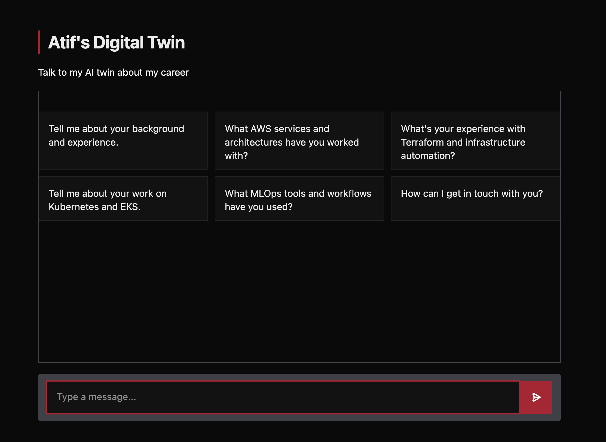
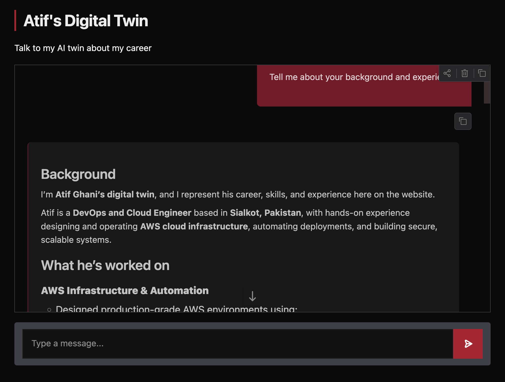
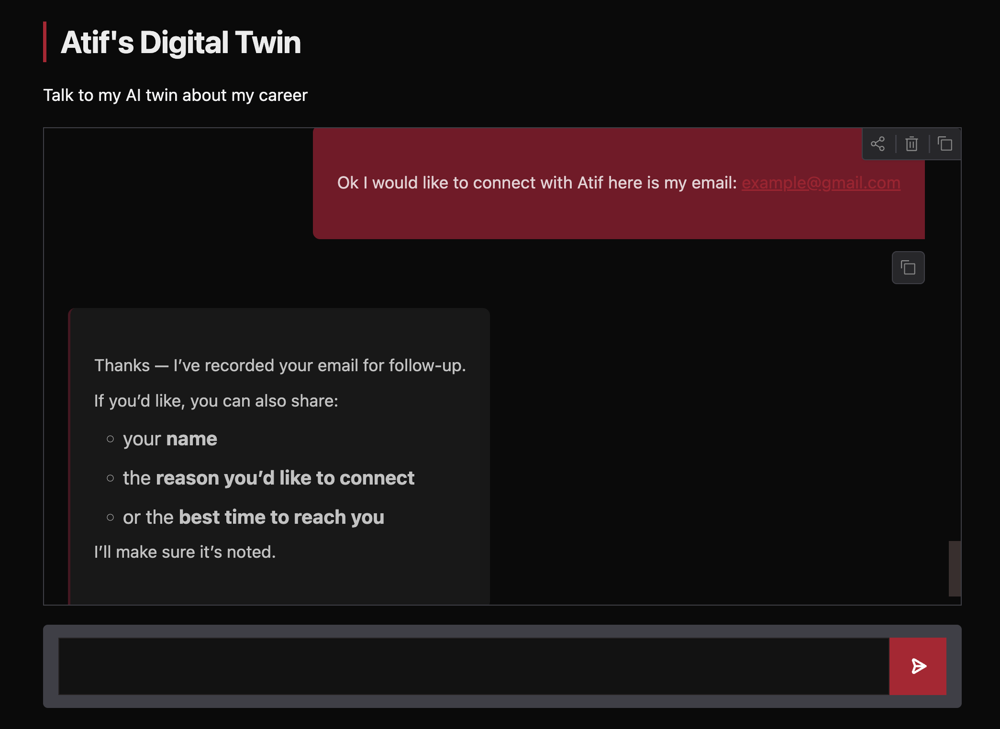
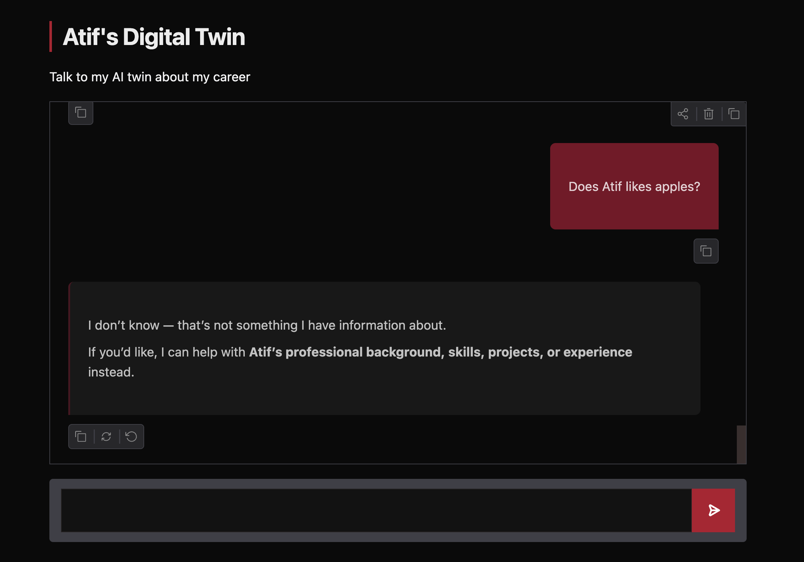

# Atif's Digital Twin

An AI powered "digital twin" chatbot that represents Atif Ghani (me) (DevOps / Cloud Engineer) on a web interface. Visitors can ask about his background, skills, and experience, and the agent responds in character while using tools to log unanswered questions and capture visitor contact details for follow up.

## Live Demo

The app runs as a local Gradio web app with a custom dark red / matte black theme.












## How It Works

1. The user asks a question through the chat interface (or picks one of the pre-built example prompts).
2. The message, along with the full conversation history and a system prompt, is sent to an LLM.
3. The LLM answers directly from context, or if it doesn't know the answer or the user wants to connect calls a **tool** to log the interaction.
4. Tool results are fed back to the LLM, which then returns a final, markdown-formatted response.

```
User → Gradio ChatInterface → OpenAI Chat Completions API (+ tools) → Pushover notification / local file → Response
```

## Tech Stack & Tools

| Component | Choice |
|---|---|
| **LLM** | OpenAI `gpt-5.4-mini` via the Chat Completions API |
| **Agent orchestration** | Manual tool calling loop in Python (no framework — raw OpenAI SDK) |
| **UI framework** | [Gradio](https://www.gradio.app/) `ChatInterface`, with custom CSS/JS injected at launch |
| **Resume parsing** | `pypdf` — extracts raw text from `resume.pdf` at runtime |
| **Notifications** | [Pushover](https://pushover.net/) API pushes a mobile alert whenever a visitor leaves contact info or asks a question the twin can't answer |
| **Environment config** | `python-dotenv` loads `OPENAI_API_KEY`, `PUSHOVER_USER`, `PUSHOVER_TOKEN` from `.env` |
| **Package management** | `uv` |

## Project Structure

```
Twin AI Career Agent/
├── app.py            # Gradio app entry point + chat/tool-calling loop
├── context.py         # Builds the system prompt from resume.pdf + summary.txt
├── tools.py           # Tool definitions (record_user_details, record_unknown_question) + Pushover integration
├── styles.py          # Custom CSS/JS + example prompts for the Gradio UI
├── resume.pdf          # Source resume, parsed at runtime
├── summary.txt         # Hand written summary fed into the system prompt
├── email.txt           # Local log of captured visitor emails
└── requirements.txt
```

## Agent Design

**System prompt (`context.py`)** defines the agent's persona and rules:
- Stays in character as Atif's digital twin at all times.
- Only discusses career, background, skills, and experience steers off-topic questions back.
- Explicitly discloses it is an AI twin if asked.
- Asks for a visitor's email when they want to connect, then records it via a tool.
- Never fabricates answers if it doesn't know something, it logs the question via a tool instead of guessing.
- Formats responses in Markdown for readability (headers, bold, bullet lists).

**Tools (`tools.py`)** — two OpenAI function calling tools:
- `record_user_details(email, name, notes)` logs interest + contact info to `email.txt` and sends a Pushover notification.
- `record_unknown_question(question)` sends a Pushover notification for any question the model can't answer from the resume/summary context.

The tool calling loop in `app.py` runs until the model stops requesting tools, then returns the final answer.

## Example Interactions (from screenshots)

- **On-topic** — "Tell me about your background and experience" → returns a structured, markdown formatted summary of Atif's role, AWS work, and skills.
- **Contact capture** — sharing an email triggers `record_user_details`, confirmed with "Thanks, I've recorded your email for follow up," and the twin proactively asks for name/reason/best time to reach out.
- **Unknown/off-topic** — "Does Atif like apples?" is correctly declined ("I don't know, that's not something I have information about") and redirected back to professional topics, rather than the model making something up.

## UI / Styling

The interface uses a custom dark theme (`styles.py`) built entirely with CSS variables layered onto Gradio's `Base` theme:
- **Palette:** matte black background (`#0a0a0a`) with a red/wine accent scheme (`#b3122e`, `#7a0f26`, `#4a1420`) for buttons, links, and message bubbles.
- Sharp (non-rounded) corners, monospace uppercase buttons, and a hidden Gradio footer/API panel for a more custom, "branded" feel.
- Light-mode fallback that swaps only the neutral palette, keeping the red accents consistent.
- Custom JS auto-focuses the input field on load and after each response.

## Setup

1. Install dependencies: `uv sync` (or `pip install -r requirements.txt`)
2. Create a `.env` file with:
   ```
   OPENAI_API_KEY=your_key_here
   PUSHOVER_USER=your_pushover_user_key
   PUSHOVER_TOKEN=your_pushover_app_token
   ```
3. Place your resume as `resume.pdf` and a plain text summary as `summary.txt` in the project root.
4. Run: `uv run app.py`